# Mettez en place des infrastructures et services Web sécurisés

**Projet n°04** - Réalisé dans le cadre de la Formation Openclassrooms - **Administrateur systeme réseaux et Cybersécurité**

**Prototype Extranet / Intranet** - Mairie de Valserac    
Prototype pédagogique (Ubuntu 22.04, Apache, FTPS, SFTP CrowdSec) pour la formation Administrateur Systèmes, Réseaux & Cybersécurité 

## Sommaire
1. [Présentation du projet](#présentation-du-projet)
2. [Architecture du prototype](#architecture-du-prototype)
3. [Installation du serveur web](#installation-du-serveur-web)
4. [Mise en place du SSL](#mise-en-place-du-ssl)
5. [Configuration virtual hosts extranet](#configuration-virtual-hosts-extranet)
6. [Test Extranet sur https](#test-extranet-sur-https)
7. [Configuration virtual hosts intranet](#configuration-virtual-hosts-intranet)
8. [Test Intranet sur https](#test-intranet-sur-https)
9. [Les Services SFTP et FTPS](#les-services-sftp-et-ftps)
10. [Gestion des Acces et Permissions](#gestion-des-acces-et-permissions)
11. [Configuration du Service SFTP](#configuration-du-service-sftp)
12. [Test du Service SFTP ](#test-du-service-sftp)
13. [Configuration du Service FTPS](#configuration-du-service-ftps)
14. [Test du service FTPS](#test-du-service-ftps)
15. [Configuration du parfeu avec UFW ](#configuration-du-parfeu-avec-ufw)
16. [Installation et configuration de mod_evasive](#installation-et-configuration-de-mod_evasive)
17. [Installation et Configuration de Crowdsec](#installation-et-configuration-de-crowdsec)
18. [Test attaque et remonté sur la console de Crowdsec](#test-attaque-et-remonté-sur-la-console-de-crowdsec)
19. [Conclusion du Projet](#conclusion-du-projet)


## Présentation du Projet

**Objectif :** Créer un prototype opérationnel pour **l’EXTRANET** et **l’INTRANET** de la **mairie de Valserac**, 
- incluant : 
    - Serveur Web sécurisé, 
    - Serveur FTP sécurisé en FTPS
    - Filtrage réseau,
    - Protection avancée.

**Context :**
Administrateur systèmes et réseaux. Le Dr. Bertri a validé le projet. 
Votre mission : fournir un prototype fonctionnel pour valider l’infrastructure avant le développement complet.

--- 

## Architecture du Prototype
- **1.** Installer et configurer une VM Linux avec Ubuntu Server pour le serveur WEB.
    - Avec deux Pattes Réseaux : 
        - Public simulé avec `150.10.0.0/16`
        - Privé avec `192.168.10.0/24`

- **2.** Créer deux sites distincts :  
  - **Extranet public**  - Acces Public simulé sur `150.10.0.0/16`
  - **Intranet privé** - Acces Uniquement via la patte réseau `192.168.10.0/24`

- **3.** Redirection HTTP vers HTTPS avec generation Certificat SSL

- **4.** Mettre en place un serveur FTPS sécurisé
    - Les **developpeur** ont *acces* a l'ensemble des fichiers `/Extranet` et `/Intranet`
    - Les **graphistes** ont *accès* seulement aux Dossiers `/Images` de chaque sites, Extranet et Intranet
    - Toute personne ayant *acces* à l'Extranet doit pouvoir deposer un fichier au format `.PDF` dans le dossier `/pdf` dans Extranet depuis l'Extranet

- **5.** Configurer un filtrage réseau strict :
    - Avec UFW
    - Mod_Evasive

- **6.** Déployer CrowdSec pour prévenir les attaques :
    - Simuler des Attaques et Remonter sur la console CrowdSec

---

##  Configuration réseau - VM-Serveur

1. VM Créé via VirtualBox : 
    - OS : Ubuntu Server 22.04 - minimal graphic
    - 2 Pattes Réseaux NATNetwork : 
        - `192.168.10.0/24`
        - `150.10.0.0/16`

2. **Attribution IPs Statiques** 
    - Pour intranet (eth0) : `192.168.10.5/24`
    - Pour extranet (eth1) : `150.10.0.5/16`

    - S'assurer que tout est à jours : `sudo apt update && sudo apt upgrade -y`

    - Un Fichier de Configuration IP avec Netplan a été créé au format `.yaml` 
        - ici : `/etc/netplan/00-installer-config.yaml`
    ```yaml 
    network:
        version: 2
        ethernets:
            enp0s3:
                dhcp4: no
                addresses: [192.168.10.5/24]
                gateway4: 192.168.10.1
                nameservers:
                    addresses: [8.8.8.8,8.8.4.4]
            enp0s8:
                dhcp4: no
                addresses: [150.10.0.5/16]           
    ```
    
    - La configuration réseau a été appliqué via : `sudo netplan apply`
    

## ** Configuration du Lab** 
|         | SERVEUR | DEV | GRAPHISTE |
|----------|--------|-----------|-----------|
| OS      | Ubuntu-Serveur 22.04 | Ubuntu 22.04 | Ubuntu 22.04 |
| Nom DNS | vm-serveur| vm-dev | vm-graphiste |
| IP Privé | `192.168.10.5` | `192.168.10.10` | `192.168.10.12` |
| IP Public simulé | `150.10.0.5` | `150.10.0.10` | `150.10.0.12` |

- Ici le DNS à été simulié via `/etc/hosts` de chaque machine

On a donc maintenant :
- [x] Serveur pret
- [x] Machine Dev Test pret
- [x] Machine Graphiste Test pret
- [x] Réseaux Fonctionnel inter-machine

---
## Installation du serveur web

###  Installation d'Apache

- Commande Installation d'Apache

```bash 
sudo apt install apache2 -y     ## Installation Apache2
sudo systemctl enable apache2   ## Lancer Automatiquement au démarage
sudo systemctl start apache2    ## Lancer Apache2
```
- Commande pour Activer/Desactiver les Modules Apache
```bash 
sudo a2enmod ssl                  ## Activé module ssl → HTTPS  
sudo a2enmod headers              ## Activé module header → securite
sudo a2enmod rewrite              ## activé module rewrite → Redirection
sudo a2dismod autoindex status    ## Desactive module inutiles
sudo systemctl restart apache2    ## Relancer Apache2
```


- Récupération des sites `/extranet` et `/intranet`
- Placé dans le répertoire `/var/www/`

- Ce qui nous donne une arborescence : 
```
./var/www/
├── extranet.valserac.com/        
│   ├── images/
│   ├── pdf/
│   ├── js/
│   ├── css/
│   └── index.html
├── intranet.valserac.com/
    ├── images/
    ├── js/
    ├── css/
    └── index.html
```
- Pour l'instant, nous laissons `www-data:www-data` en *proprietaire* et *groupe* (Apache)
```bash
sudo chown -R www-data:www-data /var/www/extranet.valserac.com  
sudo chown -R www-data:www-data /var/www/intranet.valserac.com
sudo chmod -R 755 /var/www
```
---
###  Configuration

- Rappels des Objectifs : 
    - 1.Extranet.vaslerac.com ( public )
        - IP : 150.10.0.5 
        - Ports : HTTP 80 → redirigé vers HTTPS 443
        - SSL : Certificat auto-signé ( pour le lab )

    - 2.Intranet.valserac.com : 
        - IP : 192.168.10.5
        - Ports : HTTP 5501 → redirigé vers HTTPS 5502
        - SSL : Certificat auto-signé ( pour le lab )

- Chaque VHost aura : 
    - Redirection HTTP → HTTPS
    - Logs séparés ( acces.log )
    - Droits sécurités sur les repertoires

Rappels Dossier de Configuration : `/etc/apache2/`

```bash
./etc/apache2/                ## Répertoire de Configuration Apache
├── sites-available/            ## Configuration des Vhosts de nos sites
│   ├── extranet.conf               # Vhost extranet
│   └── intranet.conf               # Vhost intranet
├── sites-enabled/              ## -- Sites Actifs
│
├── mods-available/             ## Configuration des Modules
├── mods-enabled/               ## -- Modules Actifs
│
├── ssl/                        ## Configuration de nos SSL
│
├── conf-available/             ## Configuration 
│   └── security.conf            
├── conf-enable/                ## -- Configuration actifs
│ 
├── apache2.conf               ## Configuration global d'apache2   
└── ports.conf                  ## Fichier Configuration des ports 
```


### Mesure de sécurité Générique 
- Cacher les **informations du serveur** dans le fichier `security.conf`
```bash
sudo nano /etc/apache2/conf-available/security.conf
```

- Puis on **modifie** pour **cacher la version** et les **informations** du Serveur
- Et désactivé les **requêtes TRACE**

```bash
# Cacher la version et les informations du serveur
ServerTokens Prod
ServerSignature Off
# Désactiver les requêtes TRACE
TraceEnable Off
# Protéger contre les attaques clickjacking et XSS
Header always append X-Frame-Options SAMEORIGIN
```

---

### Mise en place du SSL

Génération de Certificats SSL Auto-signé avec `openssl`


- Pour **extranet.valserac.com** :
```bash
sudo mkdir -p /etc/apache2/ssl              ## Création répertoire ssl/

sudo openssl req -x509 -nodes -days 365 \   ## Generation ssl
  -newkey rsa:2048 \
  -keyout /etc/apache2/ssl/extranet.key \   ## Notre key ssl
  -out /etc/apache2/ssl/extranet.crt        ## Notre Certificat ssl

```

- Information Certificat entré : 
    - Country Name (2 letter code) : FR
    - State or Province Name : ILE DE FRANCE
    - Locality Name : PARIS
    - Organization Name : CONSULAT DIRECTION INFRASTRUCTURE ET LOGISTIQUE
    - Organizational Unit Name : admin
    - Common Name : *extranet.valserac.com*
    - Email Address : admin@valserac.com (fictif)

- Pour **intranet.valserac.com** :
```bash
sudo openssl req -x509 -nodes -days 365 \   ## Generation ssl
  -newkey rsa:2048 \
  -keyout /etc/apache2/ssl/intranet.key \   ## Notre key ssl
  -out /etc/apache2/ssl/intranet.crt        ## Notre Certificat ssl
```

- Information Certificat entré : 
    - Country Name (2 letter code) : FR
    - State or Province Name : ILE DE FRANCE
    - Locality Name : PARIS
    - Organization Name : CONSULAT DIRECTION INFRASTRUCTURE ET LOGISTIQUE
    - Organizational Unit Name : admin
    - Common Name : *intranet.valserac.com*
    - Email Address : admin@valserac.com (fictif)

---
 

### Configuration virtual hosts extranet

- Pour **extranet.valserac.com**
```bash
# FORCER UTILISATION HTTPS
<VirtualHost 150.10.0.5:80>    ##Forcer l'ecoute de 150.10.0.5 pour Virualbox
    ## NAME & DOC ROOT
    ServerName extranet.valserac.com
    DocumentRoot /var/www/extranet.valserac.com

    ## FORCE HTTPS
    Redirect / https://extranet.valserac.com
    RewriteEngine On
    RewriteRule ^(.*)$ https://%{HTTP_HOST}$1 [R=301,L]

    ## SETUP LES LOGS
    ErrorLog ${APACHE_LOG_DIR}/error.log
    CustomLog ${APACHE_LOG_DIR}/extranet_access.log combined
</VirtualHost>

# CONFIG SSL
<VirtualHost 150.10.0.5:443>    ##Forcer l'ecoute de 150.10.0.5 pour Virualbox
    ## NAME & DOC ROOT
    ServerName extranet.valserac.com
    DocumentRoot /var/www/extranet.valserac.com

    ## CONDIF SSL SECURISE
    SSLEngine on
    SSLCertificateFile /etc/apache2/ssl/extranet.crt
    SSLCertificateKeyFile /etc/apache2/ssl/extranet.key

    ## PROTOCOLE SSL SECURISE
    SSLProtocol all -SSLv2 -SSLv3 -TLSv1 -TLSv1.1
    SSLCipherSuite EECDH+AESGCM:EDH+AESGCM:AES256+EECDH:AES256+EDH
    SSLHonorCipherOrder on

    ## EN TETE de SECURITE
    Header always set Strict-Transport-Security "max-age=63072000; includeSubDomains; preload"
    Header always append X-Frame-Options SAMEORIGIN
    Header always set X-XSS-Protection "1; mode=block"
    Header always set X-Content-Type-Options nosniff

    ## DESACTIVE LISTAGE REPERTOIRE
    <Directory /var/www/extranet.valserac.com>
        Options -Indexes -FollowSymLinks
        AllowOverride None
        Require all granted
    </Directory>

    ## SETUP LES LOGS 
    ErrorLog ${APACHE_LOG_DIR}/error.log
    CustomLog ${APACHE_LOG_DIR}/extranet_access.log combined
</VirtualHost>
```

- Activé le site → lien symbobique de `sites-available` à `site-enable`
```bash
sudo a2ensite extranet.conf         ## Racourcie UP le site via a2
sudo systemctl reload apache2       ## Reloader Apache2
```

- Vérifier la configuration
```bash
sudo apache2ctl configtest          ## Si synthaxe Ok
sudo systemctl restart apache2      ## Relancer
sudo systemctl status apache2       ## Checker le Status d'Apache
```
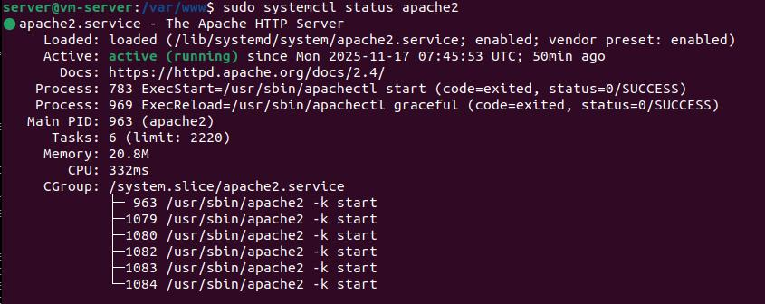 


- On va également vérifier que Apache2 écoute bien sur les ports spécifique de notre configuration : 

```bash
sudo ss -tulnp | grep apache2
```

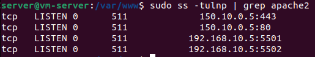 

- On a également tester avec la commande `curl` que le site `extranet` est accessible en Local avant de passer au test sur les vm-graphiste et vm-dev

```bash
curl -Ik https://150.10.0.5
```
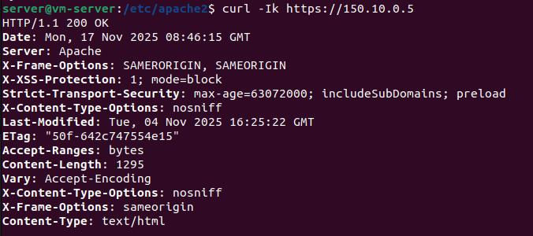 

- [x] Test Local Reussi, on peut donc passer au test sur les autres vm
---
   

### Test Extranet sur https

- Teste realisé sur la `vm-graphiste` et `vm-dev`

- Configuration du `/ect/hosts/` pour `150.10.0.5 extranet.valserac.com`

       


On a donc un Extranet sur **extranet.valserac.com**:
- [x] **Ouvert** sur l'interface 150.10.0.5 du serveur
- [x] **Redirection Actif** de `:80` → `:443` en HTTPS
- [x] **Certificat SSL Actif** sur *extranet.valserac.com*

---
 

## Configuration virtual hosts intranet

- Pour **intranet.valserac.com** :
    - Ici, pour l'intranet, le choix c'est porté d'écouter sur `5501` pour le HTTP et `5502` pour le HTTPS afin d'eviter les ports trop evident.
    - On va également **restreindre l'accès**, seulement sur la patte Réseau `192.168.10.0/24` 

- Dans un premier temps, nous devons donc **ajouter** à Apache l'écoute sur le port `5501` et `5502`
    - dans le fichier de configuration `/etc/apache2/ports.conf`

```bash
## Extranet PORT
Listen 150.10.0.5:80
Listen 150.10.0.5:443

## Intranet PORT
Listen 192.168.10.5:5501
Listen 192.168.10.5:5502
```
*Note : Pour que VirtualBox gèrent correctement les deux pattes réseaux, on force l'écoute respective*
- *de la patte réseau `150.10.0.5` sur le port `80` et `443`*
- *de la seconde patte réseau `192.168.10.5` sur `5501` et `5502`*

Nous pouvons maintenant passez à la **configuration** de la VHost nommé **intranet.conf**

```bash
## CONFIG HTTP sur 5501 et REDIRECTION VERS HTTPS sur 5502
<VirtualHost 192.168.10.5:5501>
    ## NAME & DOC ROOT
    ServerName intranet.valserac.com
    DocumentRoot /var/www/intranet.valserac.com

    ## FORCER REDIRECTION VERS HTTPS:5502
    Redirect / https://intranet.valserac.com:5502/

    ## SETUP LOGS
    ErrorLog ${APACHE_LOG_DIR}/intranet_error.log
    CustomLog ${APACHE_LOG_DIR}/intranet_access.log combined
</VirtualHost>

## INTRANET HTTPS sur 5502 et LIMITATION a 192.168.10.0/24
<VirtualHost 192.168.10.5:5502>
    ## NAME & DOC ROOT
    ServerName intranet.valserac.com
    DocumentRoot /var/www/intranet.valserac.com

    ## ACTIVITE CERTIFACT SSL 
    SSLEngine on
    SSLCertificateFile /etc/apache2/ssl/intranet.crt
    SSLCertificateKeyFile /etc/apache2/ssl/intranet.key

    ## PROTOCOLE SSL SECURISES 
    SSLProtocol all -SSLv2 -SSLv3 -TLSv1 -TLSv1.1
    SSLCipherSuite EECDH+AESGCM:EDH+AESGCM:AES256+EECDH:AES256+EDH
    SSLHonorCipherOrder on

    ## EN TETE SECURITE 
    Header always set Strict-Transport-Security "max-age=63072000; includeSubDomains; preload"

    ## DESACTIVATION LISTAGE & LIMITATION IP
    <Directory /var/www/intranet.valserac.com>
        DirectoryIndex index.html index.php
        Options -Indexes -FollowSymLinks
        AllowOverride None
        Require all granted
        ## LIMITATION a 192.168.10.0/24
        Require ip 192.168.10.0/24
    </Directory>

    ## SETUP LOGS 
    ErrorLog ${APACHE_LOG_DIR}/intranet_error.log
    CustomLog ${APACHE_LOG_DIR}/intranet_access.log combined
</VirtualHost>
```
Une fois **activé** avec le **module a2** et **relancé le systeme** apache avec les commandes plus haut. Nous pouvons donc maintenant tester locaux avant le test sur nos `vm-dev` et `vm-graphiste`

- On a également tester avec la commande `curl` que le site `inttranet` est accessible en Local avant de passer au test sur les vm-graphiste et vm-dev

```bash
curl -Ik https://192.168.10.5:5502
```
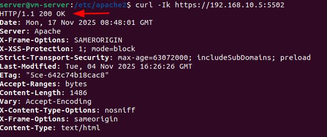 

- [x] Test Local Reussi, on peut passer au test sur les vm


---
   

### Test Intranet sur https

- Teste realisé sur la `vm-graphiste` et `vm-dev`

- Configuration du `/ect/hosts/` pour `192.168.10.5 intranet.valserac.com`

       


On a donc un Intranet sur **intranet.valserac.com**:
- [x] **Ouvert** sur l'interface 192.168.10.5 et uniquement accessible par la patte réseau `192.168.10.0/24`
- [x] **Redirection Actif** de `:5501` → `:5502` en HTTPS
- [x] **Certificat SSL Actif** sur *intranet.valserac.com*

On peut donc allé checker les logs Apache pour vérifier qu'il remonte bien les connexions 

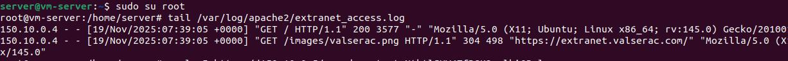

- [x] Une remonté des Logs des connexions sur **Extranet** et **Intranet**

---

 


## Les Services SFTP et FTPS 

Nous allons mettre un place un Service **SFTP** et un Service **FTPS** pour notre infrastructures Web.
Qui permettra à nos **Developpeurs** et **Graphiste** de Travailler sur les élements spécifique du site.

Rappels du besoin : 
- Developpeurs : Acces a l'ensemble de **Extranet** et **Intranet**
- Graphistes : **Seulement** Acces aux repertoires **images** de l'Extranet et de l'Intranet


Les Protocoles **SFTP** et **FTPS** sont Totalement Différents :

---

### Le SFTP ( SSH File Transfer Protocol )

Le **SFTP** est un protole **FTP** basé sur **SSH** :
- Utilise le **Port 22** ( **SSH** Uniquement )
- Du Chiffrement **via SSH** ( pas de certificat TLS )

---

### LE FTPS ( FTP avec chiffrement TLS )

Extension sécurisé du protocole FTP classique
- Utilise le **port 21** ( Commande )
- Utilise le **port 20** ( data ) ou ports passifs ( ici, on configurera des ports passifs )
- Du Chiffrement **via TLS** ( certifcat )


---
 
## Gestion des Acces et Permissions

Nous allons créer un **Groupe** pour les **Graphistes** et un **groupe** pour les **Developpeurs**

- Groupe Graphistes : **graph**
- Groupe Developpeurs : **dev**

Pour le Test de la configuration, nous allons créer 2 utilisateurs : 

- Graphiste : **testgraph**
- Developeur : **testdev**


```bash
sudo adduser testgraph              ##Creation user
sudo adduser testdev 

sudo groupadd graph                 ##Creation groupe 
sudo groupadd dev                   
                 
sudo usermod a -G graph testgraph    ##Ajout des users au groupe
sudo usermod a -G dev testdev

sudo passwd testgraph               ##Ajout mot de passe
sudo passwd testdev
```

Maintenant que les utilisateurs et groupes sont établie. Nous allons pouvoir attribuer des droits et permissions sur les fichiers du sites, en fonction de leur besoin.

Le choix a été fait de garder apache en proprietaire (www-data) sur l'ensemble des fichiers dans un premier temps, puis d'attribuer via le Groupe les acces - permission des fonctions.

Pour l'architecture général et l'acces aux dossiers : 
- extranet.valserac.com
- intranet.valserac.com 

Ce sera donc Apache **(www-data)** en propriétaire-utilisateur et en groupe **dev**
- Avec une permission de `750` (r-w-x et r-x)

```bash
sudo chown -R www-data:dev /var/www/extranet.valserac.com
sudo chown -R www-data:dev /var/www/intranet.valserac.com
sudo chmod -R 750 /var/www/extranet.valserac.com
sudo chmod -R 750 /var/www/intranet.valserac.com
```

On peut donc maintenant passé à l'attribution du fichier `/images` par le groupe `graphiste` 

```bash
sudo chown -R www-data:graph /var/www/extranet.valserac.com/images
sudo chown -R www-data:graph /var/www/intranet.valserac.com/images
sudo chmod -R 750 /var/www/extranet.valserac.com/images
sudo chmod -R 750 /var/www/intranet.valserac.com/images 
```

Configuration Spéciale pour le répertoire `/pdf` uniquement accessible par **Apache** 

```bash 
sudo chown -R www-data:www-data /var/www/extranet.valserac.com/pdf
sudo chmod -R 750 /var/www/extranet.valserac.com/pdf
```

Nous avons ici, une configuration qui crée une spération claire des roles et respecte le principe de sécurité du **moindre privilège**, chaque utilisateur n'a acces qu'aux ressources **strictement** nécessaire à son travail

---
 
## Configuration du Service SFTP

Pour la configuration du service SFTP, nous allons crée une Arboressance avec un **chroot**

Comme nous utilisons le protocle SSH via le port 22, nous devons avoir une segmentation de l'espace de travail pour garantir un acces sécurisé. 

Chacun des utilisateurs, ici **testgraph** et **testdev** auront un acces spécifique a des dossiers spécifique dans un dossier contenu par l'utilisateur et le groupe root.

Nous allons créer un répertoire `sftp/`
avec un répertoire par utilisateurs : 
- `testgraph/`
- `testdev/`

Et dans chaque répertoire attribué leur dossier où il pourront travaillé, par un **bind - montage** qui permettra de ne pas travaillé directement dans les repertoires sources.

Configration de l'arborescence du sftp : 

```bash
/sftp/
│── testgraph/
│     ├── extranet_images/
│     └── intranet_images/
│
└── testdev/
      ├── www_extranet/
      └── www_intranet/
```

Commande configuration : 

```bash
sudo mkdir -p /sftp/testgraph/extranet_images
sudo mkdir -p /sftp/testgraph/intranet_images

sudo mkdir -p /sftp/testdev/www_extranet
sudo mkdir -p /sftp/testdev/www_intranet
```

Commande Configuration des permissions pour un **chroot** :

```bash
sudo chown root:root /sftp
sudo chmod 755 /sftp

sudo chown root:root /sftp/testgraph
sudo chmod 755 /sftp/testgraph

sudo chown root:root /sftp/testdev
sudo chmod 755 /sftp/testdev
```

Commande Configuration Repertoire accessible en écriture par les utilisateurs : 

```bash
sudo chown testgraph:graph /sftp/testgraph/extranet_images
sudo chown testgraph:graph /sftp/testgraph/intranet_images

sudo chown testdev:dev /sftp/testdev/www_extranet
sudo chown testdev:dev /sftp/testdev/www_intranet
```

Nous avons maintenant une architecture avec une gestion des permissions établie en fonction du besoin.

---
### Faire le Bind-mount des dossiers web dans le chroot

Pour les graphistes, ici représenter par notre utilisateur **testgrap ** on va monter :
- `/var/www/extranet.valserac.com/images` vers `/sftp/testgraph/extranet_images`
- `/var/www/intranet.valserac.com/images` vers `/sftp/testgraph/intranet_images`

Pour les Developeurs, dans l'espace chroot du **dev** on va monter : 
- `/var/www/extranet.valserac.com` vers `/sftp/testdev/www_extranet`
- `/var/www/extranet.valserac.com` vers `/sftp/testdev/www_extranet`

Commande avec `mount --bind` :

```bash 
sudo mount --bind /var/www/extranet.valserac.com/images /sftp/testgraph/extranet_images
sudo mount --bind /var/www/intranet.valserac.com/images /sftp/testgraph/intranet_images

sudo mount --bind /var/www/extranet.valserac.com /sftp/testdev/www_extranet
sudo mount --bind /var/www/intranet.valserac.com /sftp/testdev/www_intranet
```

Nous allons rendre les montages persistants en editant le fichier `fstab`  ( /etc/fstab )

Puis rajouter : 

```bash
# SFTP chroots bind mounts
/var/www/extranet.valserac.com/images   /sftp/testgraph/extranet_images   none    bind  0 0
/var/www/intranet.valserac.com/images   /sftp/testgraph/intranet_images   none    bind  0 0

/var/www/extranet.valserac.com          /sftp/testdev/www_extranet        none    bind  0 0
/var/www/intranet.valserac.com          /sftp/testdev/www_intranet        none    bind  0 0
```

Puis appliquer la nouvelle configuration :

```bash
sudo mount -a
```

On va mainteant pouvoir stipuler notre nouvelle configuration au service ssh pour activer le SFTP chroot

En Editant le fichier `etc/ssh/sshd_config`

Puis appliquer via : 

```bash
Subsystem sftp internal-sftp

Match Group graph
    ChrootDirectory /sftp/%u
    ForceCommand internal-sftp
    AllowTCPForwarding no
    X11Forwarding no

Match Group dev
    ChrootDirectory /sftp/%u
    ForceCommand internal-sftp
    AllowTCPForwarding no
    X11Forwarding no
```

Valider en suite la mise en place de la Config & redemarrer le service ssh: 

```bash
sudo sshd -t
sudo systemctl restart ssh
```

Vérifier que notre service ssh et activé via : 

```bash 
sudo systemctl status ssh
```

Nous allons pouvoir mainteant tester notre configuration du service SFTP avec chroot
sur nos `vm-dev` et `vm-graph`

---
 


## Test du Service SFTP 

Notre configuration **SFTP** étant mis en place, nous allons **tester** dans un premier temps via la console, puis via le service FileZilla. 

Via la console de notre vm-graphiste avec : 

```bash
sftp testgraph@192.168.10.5
``` 

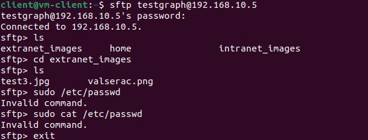


- [x] Test réussi de l'accès via **SFTP** via la **console** 

Nous allons passé au test via **FileZila** qui simulera un environement de travail, nottament pour les graphistes. 

Nous devons dans un premier temps configuré l'acces du SFTP dans FileZilla 

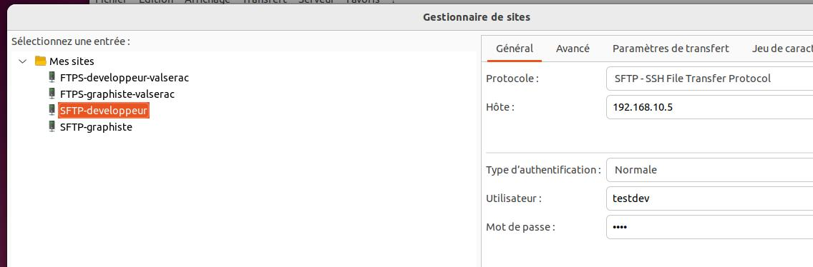

Une fois configuré on peut accèder a nos dossiers respectifs avec les identifiants et mot de passe de chacun

Pour les Graphistes : 

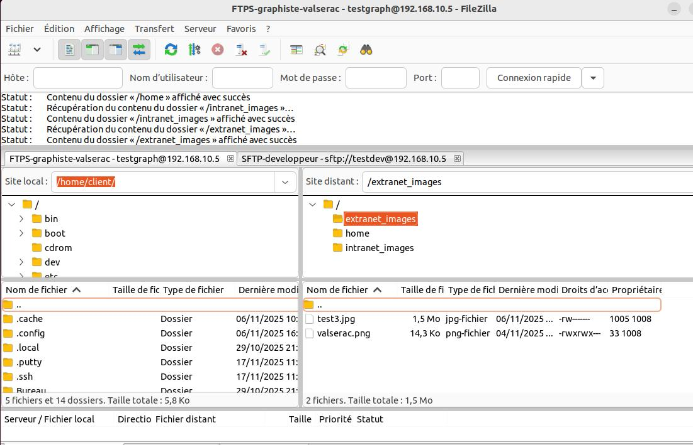

Pour les Developpeurs : 

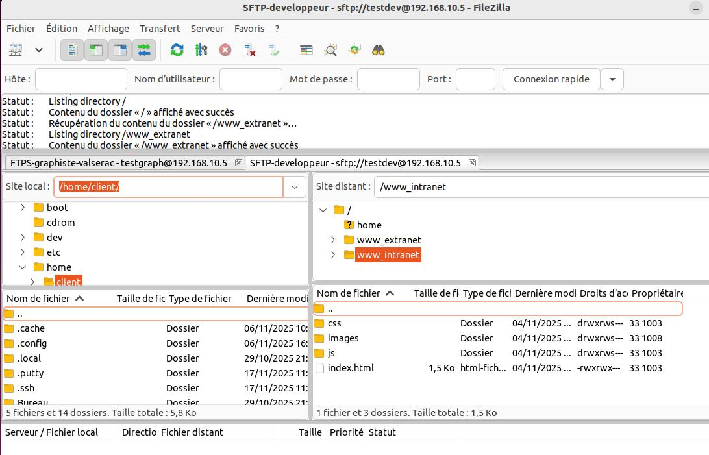

Nous avons donc mainteant un service **SFTP** via **FileZilla** configuré et pret à etre **opérationnel**. 

---


## Configuration du Service FTPS

Nous allons maintenant passez à la configuration du service FTP Sécurisé pour nos déveoppeur et Graphiste, a des fin de découverte et de mise en pratique de ce service.

Nous allons nous appuyser sur le dossier chroot du service SFTP mis en place. 
Avec un acces FTPS sur les dossiers de nos utilisateurs, testgraph et testdev

Le service FTP et proposé par `vsftp` que nous allons installé et configuré

```bash
sudo apt install vsftpd -y                       ##Installation 
sudo cp /etc/vsftpd.conf /etc/vsftpd.conf.backup ##Backup de la config initial
```

Avant de configurer le fichier de configuration de vsftpd, nous allons générer un certificat TLS pour sécurisé les échanges FTP et avoir un serivce FTPS

```bash
sudo openssl req -x509 -nodes -days 365 -newkey rsa:2048 \
-keyout /etc/apache2/ssl/vsftpd.key \
-out /etc/apache2/ssl/vsftpd.pem
```
à noter ici que le lab, la .key et le .pem sont stocké dans notre repertoire ssl

Comme nous avons ébalis des dossiers spécifique aux utilisateurs **testgraph** et **testdev**
Nous devons stipuler à `vsftpd` ( notre service FTP ) que chaque utilisateur aura un dossier spécifique. Pour ca, on créer un fichier de configuration pour chaque session dans le dossier qui ce trouve ici :
- `etc/vsftd_user_conf/`

On aura donc un fichier de configuration pour :
- testgraph
- testdev

avec la configuration oour la session testgrap : 

```bash
local_root=/sftp/testgraph
write_enable=YES
anon_world_readable_only=NO
anon_upload_enable=NO
local_umask=022
```

et pour la session testdev :

```bash
ocal_root=/sftp/testdev
write_enable=YES
anon_world_readable_only=NO
anon_upload_enable=NO
local_umask=022
```
De cette manière, lors de chaque session établie via FTPS les utilisateurs tomberons directement dans leur repertoires comme via le protocle SFTP que nous avons mis en place précedemment.

Nous devons maintenant **configuré** le service FTP via `vsftp.conf` en stipulant que chaque utilisateur a son **local root.**

Rappel que le protocole FTP utilise plusieurs ports pour les échanges : 
- Le **port 21** pour la **commande**
- le **port 20** pour la **data** ou les ports **passifs**
- Ici nous utiliserons également les ports **passif** sur `4000` à `40100`
- Et un acces **uniquement** via l'interface réseau du serveur `192.168.10.5`

Nous pouvons donc editer le fichier de configuration du service `vsftp`
qui se trouve ici `/etc/vsftpd.conf` avec les élements suiviant : 

```bash
# Paramètres généraux
listen=YES
listen_ipv6=NO
#connect_from_port_20=YES
#connect_from_port_21=YES

write_enable=YES
dirmessage_enable=YES
use_localtime=YES
xferlog_enable=YES
xferlog_std_format=YES
secure_chroot_dir=/var/run/vsftpd/empty
pam_service_name=vsftpd

# Désactiver explicitement l'accès anonyme
anonymous_enable=NO

listen_address=192.168.10.5

# Configuration du chroot utilisateurs
local_enable=YES
chroot_local_user=YES
allow_writeable_chroot=YES
user_config_dir=/etc/vsftpd_user_conf


# Configuration du mode passif
pasv_enable=YES
pasv_min_port=40000
pasv_max_port=40100
pasv_address=192.168.10.5


# Configuration de journalisation avancée
log_ftp_protocol=YES
xferlog_enable=YES
xferlog_std_format=YES
xferlog_file=/var/log/vsftpd.log

# Sécuriser les transferts
rsa_cert_file=/etc/apache2/ssl/vsftpd.pem
rsa_private_key_file=/etc/apache2/ssl/vsftpd.key

ssl_enable=YES
allow_anon_ssl=NO
force_local_data_ssl=YES
force_local_logins_ssl=YES
ssl_tlsv1=YES
ssl_sslv2=NO
ssl_sslv3=NO
require_ssl_reuse=NO
ssl_ciphers=HIGH
```

On va pouvoir **redemarrer** et **activer** les services par default

```bash
sudo systemctl restart vsftpd
sudo systemctl enable vsftpd
sudo systemctl status vsftpd   ##Checker le status actifs
```
Nous avons mainteant une configuration du service FTPS via **vsftpd** établie et prete à etre tester sur nos vm.  

---
 

 

## Test du service FTPS 

**Sur les `vm-dev` et `vm-graphiste`**

Afin de **simuler** un environnement de travail inter-département, nous avons également tester via le service FileZilla

Après avoir installer et configuré la connexion via l'interface de FileZilla avec **l'adresse IP du Serveur**, **Le Users** et **mot de passe** adéquat
Puis également configuré la connexion en **paramètre passive** comme configuré dans le `vsftpd.conf` nous devons stipuler les échanges en mode passive également.

1. **Acces des comptes par fileZilla :**
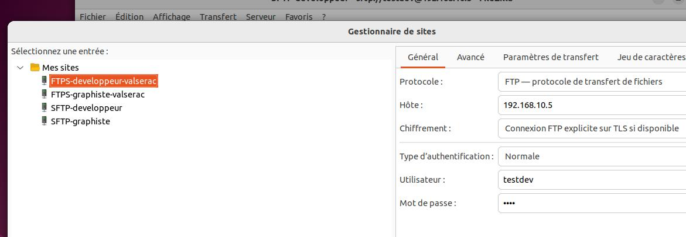

2. **Acces testgraph via fileZilla :**
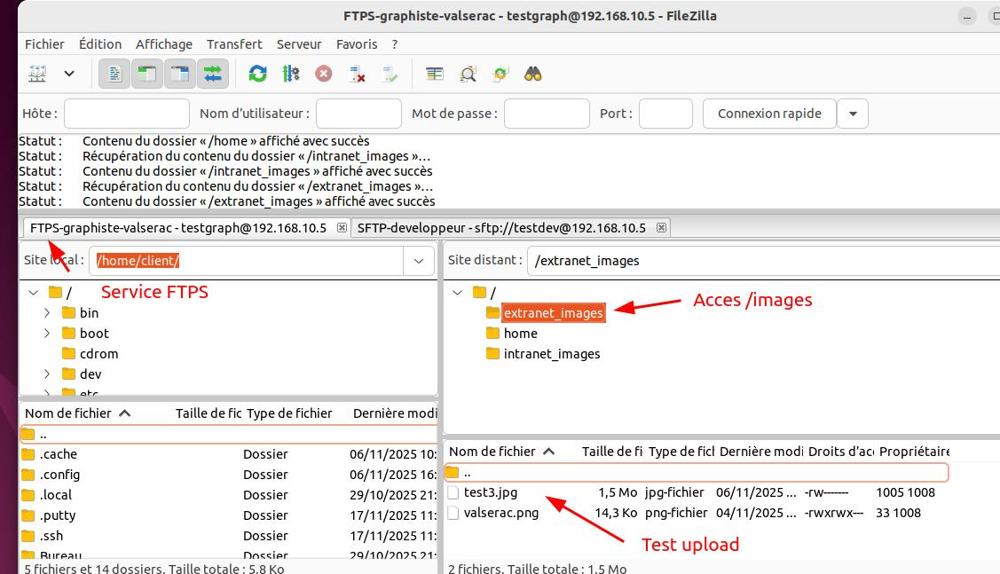

3. **Acces testdev via fileZilla :**
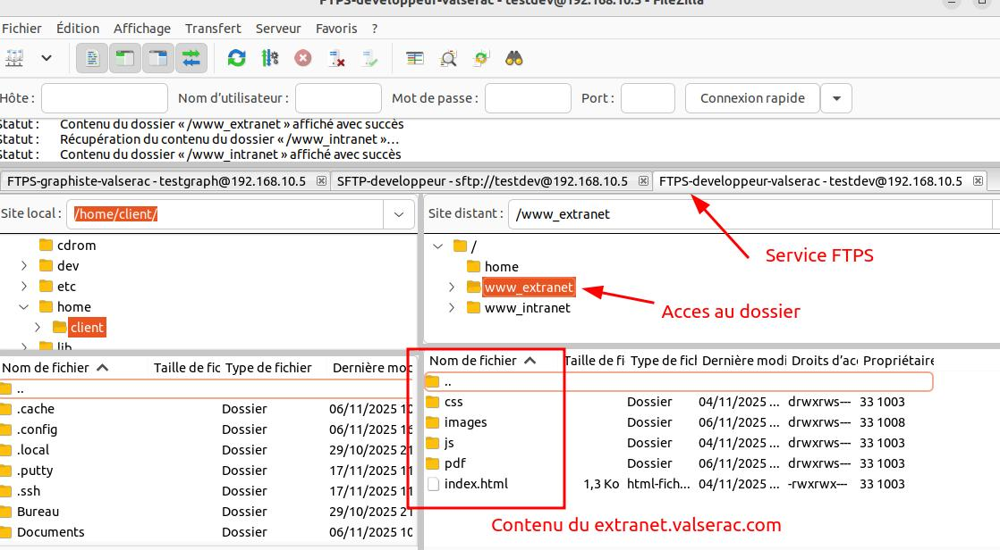


- [x] **Etablie** ayant acces reussi sur le dossier `/images`
- [x] **Test Upload** reussi dans le dossier `/images`

Nous avons mainteant une connexion **FTPS** Etablie et **fonctionnelle**


 

### Nous offrons donc mainteant un service **SFTP** et **FPTS** mis en place sur notre infrastructure web sécurisé via un acces chroot

---
 
## Configuration du parfeu avec UFW 

La mise en place du parfeu par **UFW** a été mis a jour durant la mise en place du projet web

- Mais la règle général a été de tout `Deny` dans un premier temps
- Puis **d'Authorisé** le port `22` pour **SSH** pour administrer le serveur depuis l'Hote
- D'**Authorisé** le port `80` (HTTP) et `443`(HTTPS) sur l'interface **enp0s8** `150.10.0.5` sur Tout - Simulation Extranet publique
- D'**Authorisé** le port `5501` et `5502` sur l'interface **enp0s3** uniquement accessible via la patte réseau `192.168.10.0/24`
- et d'**Authorisé** plusieurs port pour le **FTPS** : 
    - port `20` et `21` uniquement via `192.168.10.0/24`
    - puis port `40000:40100` uniquement via `192.168.10.0/24`
    - et également le port `990` uniquement via `192.168.10.0/24`

```bash
To                         Action      From
--                         ------      ----         
80,443/tcp on enp0s8       ALLOW IN    Anywhere                  
5501,5502/tcp on enp0s3    ALLOW IN    192.168.10.0/24  
         
20/tcp                     ALLOW IN    192.168.10.0/24 
21/tcp                     ALLOW IN    192.168.10.0/24   
22/tcp                     ALLOW IN    Anywhere   
        
40000:40100/tcp            ALLOW IN    192.168.10.0/24                   
990/tcp                    ALLOW IN    192.168.10.0/24 
```

---
 
### Partie Securisation Active 
1. Défense **Local** (Apache) avec le **mod_evasive** vs attaque type DoS simple / abusive sur Apache
2. Dégense **Collaboratve** au niveau du Systeme avec **Crowdsec** au niveau des IP

### Installation et configuration de mod_evasive`
**Installation**

```bash
sudp apt install libapache2-mod-evasive -y      ##Installation du mod evasive
sudo a2enmod evasive                            ##Activation Evasive avec a2
```
**Configuration de base**
- Fichier de Configuration : `/etc/apache2/mods-available/evasive.conf`

```bash
<IfModule mod_evasive20.c>
    DOSHashTableSize    3097
    DOSPageCount        2              ##Plus de 2 requetes meme pages
    DOSSiteCount        50
    DOSPageInterval     1
    DOSSiteInterval     1
    DOSBlockingPeriod   10             ##Bloque pour 10sec

    DOSEmailNotify      admin@valserac.com
    DOSSystemCommand    "su - someuser -c '/sbin/... %s ...'"
    DOSLogDir           "/var/log/mod_evasive"
</IfModule>
```

- [x] Installation et Configuration Simple du `mod_evasive` d'Apache vs les attaques DDos simple

 
## Installation et Configuration de Crowdsec

CrowdSec detecte les Intrusions et fait de la prévention
- Il surveille les logs systeme ( Apache, SSH, FTP, etc )
- Détecte les Comportements suspects et Bannit automatiquement les IPS

- Bénéficie d'une Base Communautaire regroupant des bibles d'adresse mailveillantes partagé entre les utilisateurs du monde en entier

**1. Instalation de CrowdSec via** 
```bash
sudo apt install crowdsec -y
```
Crowdsec détecte automatique les services et configure les logs

**2. Check les collections des services pris en charge**
```bash 
sudo cscli collections list
```
**3. Ajouter le Bouncer ( le Bloqueur )**
- ici, on veut celui d'apache

```bash
sudo apt install crowdsec-bouncer-apache -y
```
**4. Vérifier que le bouncer est installé via**
```bash
sudo cscli bouncers list
```

**5.Mettre explicitement le liens vers les logs d'Apache pour Crowdsec**
- Via la configuration du fichier `acquis.yaml`
- ici : `/etc/crowdsec/acquis.yaml`

Configuration necessaire :
```bash
filenames:
  - /var/log/apache2/access.log
  - /var/log/apache2/error.log
labels:
  type: apache2
```

**6. Puis relance et checker Crowdsec**
```bash
sudo systemctl reload crowdsec
sudo systemctl status crowdsec
```
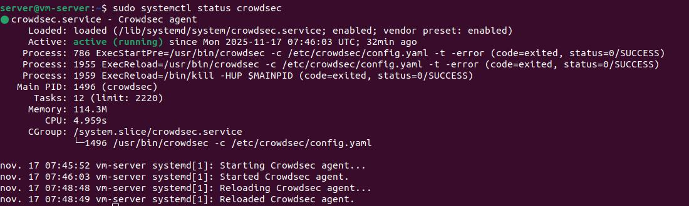

**Crowdsec** est maintenant **actif** et **opérationnel**


---
  

## Test attaque et remonté sur la console de Crowdsec 

- Configureration de notre serveur avec la console Crowdsec 


- Avant de tester les test d'attaques, vérifions que les collections pour défendre notre serveur Web sont bien installé sur le serveur :
```bash
sudo cscli collections list
```
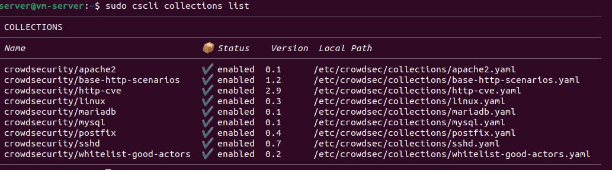


- Puis ensuite vérifier que le Bouncer ( le bloquer ) est également bien installé sur le serveur :

```bash
sudo cscli bouncers list
```
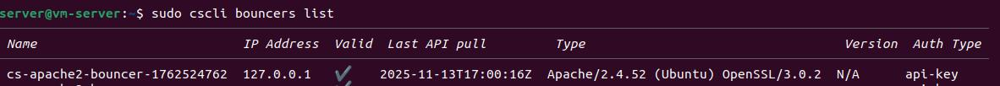


Les Collections et le Bouncer pour apache sont bien installé sur le serveur, on peut donc passer au test d'attaque pour :

- S'assurer que les logs des attaques remontes & bloque le IP :
    - Avec les Test des Scénario d'**attaque sur SSH** et **HTTP généric** 


Commande pour tester l'attaque sur HTTP :

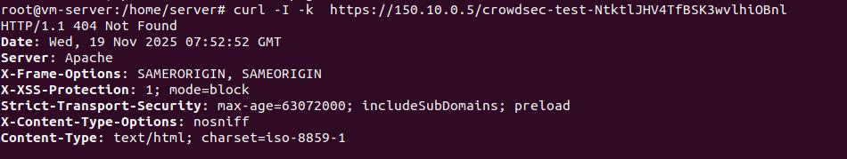

On peut donc checker **directement** dans console l'alerte de Crowdsec avec le module **cscli** qui nous stipule **bien** une alerte

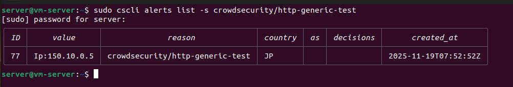

mais également avec la **metrics** qui remonte également l'alerte : 

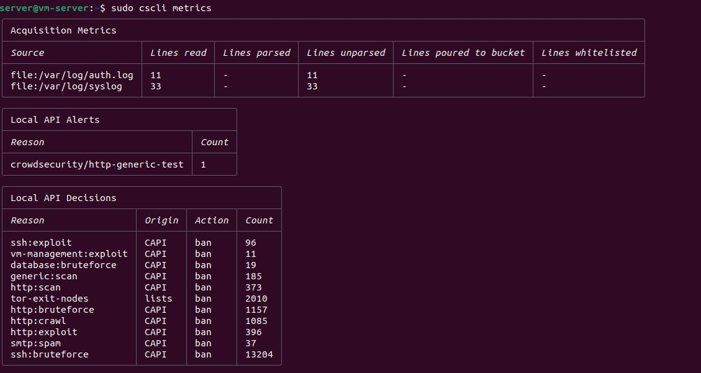

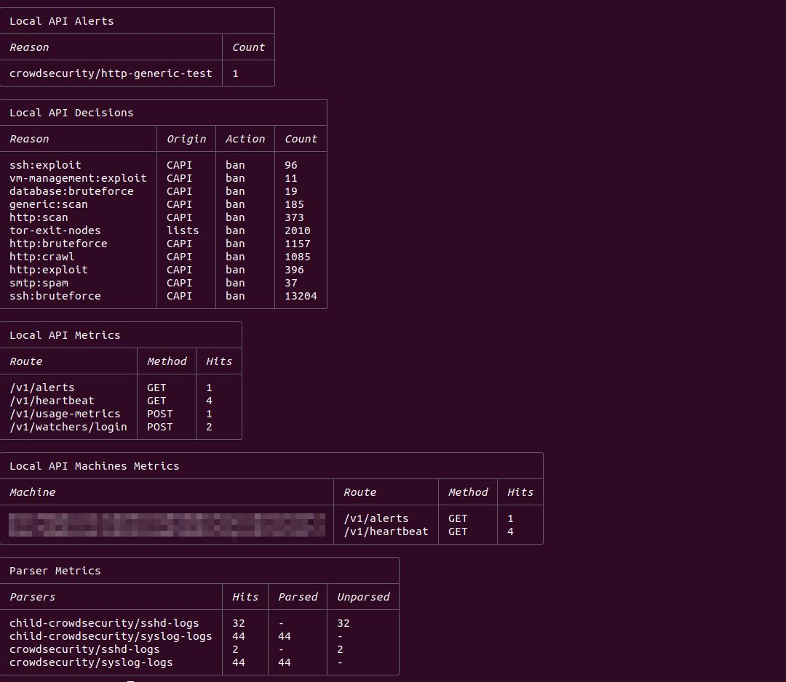

- Puis vérifier la **Remonté** sur la console Crowdsec 


- On a donc mainteant notre serveur web qui possède une sécurisation via 
    - `mod_evasive` d'Apache vs les **DDos simple**
    - `Crowdsec` pour une protection Communautaire vs les IPs 


### Conclusion du Projet 


Au cours de ce projet sur l'installation et la configuration d'une Infrastructure web via la mairie de Valserac, on a pu appliquer les compétences en :
- **Administration système** avec l'installation, la configuration et la gestion de services Linux
- Le **réseaux**, avec les différents NAT, pare-feu, ports et protcoles
- Une mise en place de **Cybersécurité**, avec une **protection applicative** de `Crowdsec` et d'une protection de **DDos simple** avec `Evasive`
- Une Supervision sur la lecture et exploitation des logs
- Sur la manipulation applicative des commandes **shell**
- Ainsi qu'une **redaction de rapport de la documentation technique**

**Merci** d'avoir pris le temps de lire mon projet **d'infrastruce web**, un projet qui s'inscrit dans l'apprentissage et la monté en compétences au travers de la formation **Administrateur système, réseaux et cybersécurité.**

---
**Alexis alias Faramir!**
